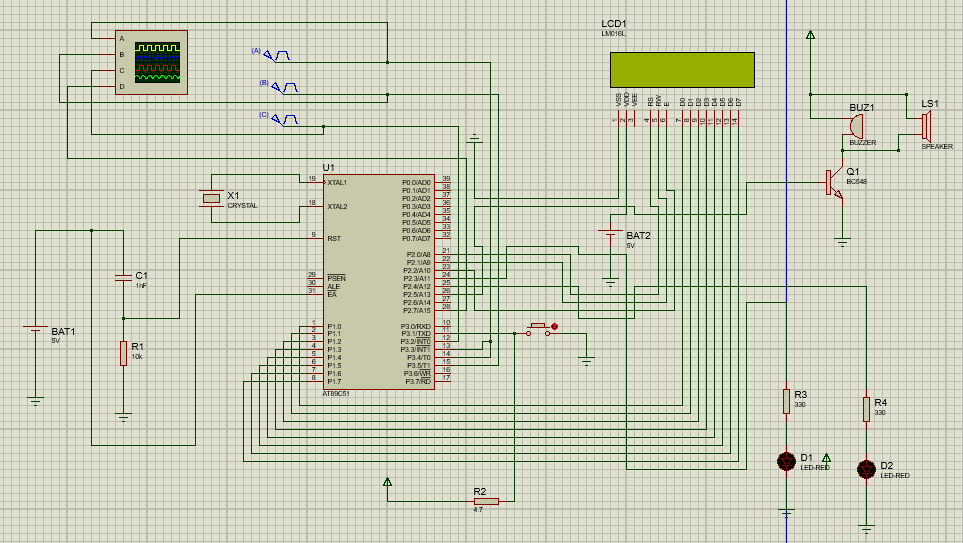

# Pulse Width and Frequency Measurement System

An 8051-based embedded system designed to measure, analyze, and display signal characteristics in real-time.

## Overview
This project focuses on high-precision frequency and pulse width (Duty Cycle) measurement. It utilizes a state-machine logic to cycle through different signal analysis tasks, including stability checking and frequency comparison.

This project uses an **8051 Microcontroller** to measure the frequency and duty cycle of input signals. It features a manual state machine controlled by a pushbutton, stability analysis with a buzzer, and a Min/Max frequency tracker.

## Features
* **Frequency Measurement:** Measures F1, F2, and F3 using Timer 0/1 and software polling.
* **Duty Cycle:** Calculates the pulse width of the input signal in percentage.
* **Stability Indicator:** Samples the first wave 5 times. If the signal fluctuates > 5Hz, the buzzer sounds and an "Unstable" message is displayed.
* **Min/Max Tracker:** Stores and displays the highest and lowest frequencies recorded during the session.
* **Frequency Difference:** Identifies the two highest frequencies and outputs a wave representing their difference.

## 🛠 Hardware Setup
* **Microcontroller:** AT89C51 / AT89S52
* **Display:** 16x2 LCD (P1 for Data, P2.0-P2.2 for Control)
* **Indicators:** * LED 1 (P2.3) - Power/Initialization
  * LED 2 (P2.4) - Task Active
  * Buzzer (P2.5) - Stability Alert
* **Inputs:** * P3.1 - Pushbutton (State Switch)
  * P3.4, P3.5, P3.2 - Frequency Inputs
  * P3.3 - Duty Cycle Input
 
  

## How to Use
1. Power on the system (LED 1 will turn on).
2. **Step 0:** View F1 Frequency and Duty Cycle. The system checks stability here.
3. **Press Button:** View F2 Frequency (LED 2 turns on).
4. **Press Button:** View F3 and a comparison of all frequencies.
5. **Press Button:** View the Difference (Hz) and check the output pin (P2.7).
6. **Press Button:** View the session's Min and Max frequency values.
7. **Press Button:** View the Stability Result ("1st Wave Stable").
