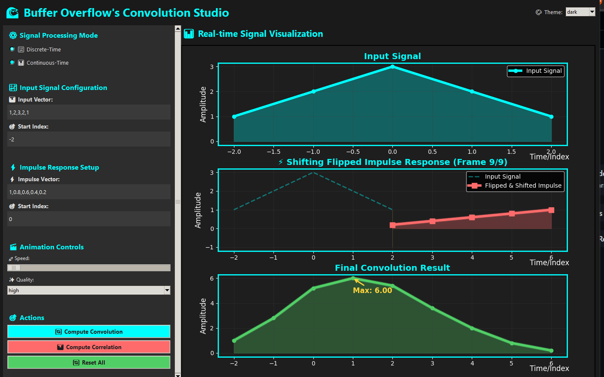

# Buffer Overflow's Convolution Studio

A modern, interactive **signal processing visualization tool** built with Python, Tkinter, NumPy, and Matplotlib.  
It provides an intuitive GUI to explore **convolution and correlation** for both discrete-time and continuous-time signals with real-time animated visualization.

---

## Features

### Signal Processing Modes
- **Discrete-Time Signals**
  - Custom input & impulse sequences
  - Index-based signal definition
- **Continuous-Time Signals**
  - Built-in signal types:
    - Impulse
    - Step
    - Triangular
    - Rectangular
    - Sawtooth

---

### Core Functionalities
- Convolution (np.convolve)
- Cross-correlation (np.correlate)
- Real-time animated visualization of convolution process
- Flipped impulse response visualization
- Output signal construction step-by-step

---

### Advanced Visualization
- Smooth real-time animation engine (threaded)
- Glow effects for high-quality rendering
- Overlap region highlighting
- Progress tracking during computation
- Final result annotation (peak detection)

---

### UI & UX
- Dark / Light theme support
- Modern styled Tkinter interface
- Scrollable control panel
- Adjustable animation speed
- Quality modes (Standard / High / Ultra)
- Embedded Matplotlib plots inside GUI

